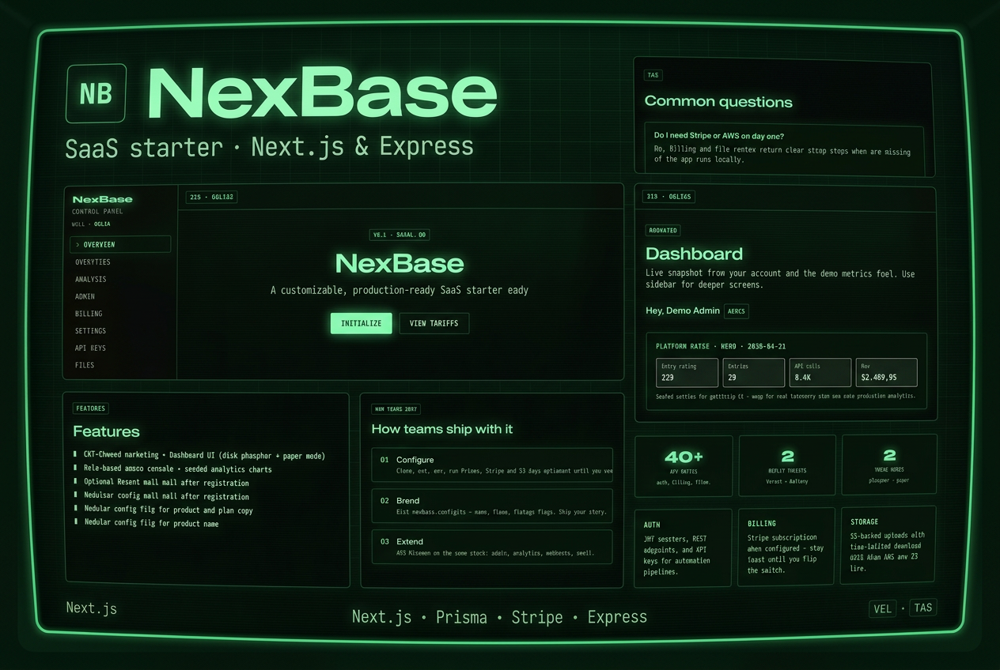

<p align="center">
  <strong>NexBase</strong><br />
  <sub>Production-minded SaaS starter — Next.js · Express · Prisma · PostgreSQL</sub>
</p>

<p align="center">
  <a href="https://nexbase-five.vercel.app/"><strong>Live demo → nexbase-five.vercel.app</strong></a>
</p>

<p align="center">
  <a href="https://nexbase-five.vercel.app/">
    
  </a>
</p>

<p align="center">
  
  
  
  
</p>

<p align="center">
  <a href="https://x.com/WebRaizo"></a>
</p>

---

## What is this?

**NexBase** is a **single-repo full-stack** SaaS starter: marketing site, auth, dashboard, admin, billing hooks, file uploads, and analytics UI wired to a typed REST API.

| | |
|--|--|
| **Live demo** | [nexbase-five.vercel.app](https://nexbase-five.vercel.app/) |
| **Highlights** | 40+ API routes; CRT-style themes (phosphor · paper); Stripe, S3, and Resend **degrade gracefully** when not configured |
| **Deploy** | Frontend → Vercel; API → Railway, Render, Fly.io, etc. (joined via `NEXT_PUBLIC_API_URL`) |

## Table of contents

- [Architecture](#architecture)
- [Repository layout](#repository-layout)
- [Prerequisites](#prerequisites)
- [Local development](#local-development)
- [Environment variables](#environment-variables)
- [Production deployment](#production-deployment)
- [Scripts reference](#scripts-reference)
- [Customization](#customization)
- [Security checklist](#security-checklist)
- [API surface (overview)](#api-surface-overview)
- [License](#license)

## Architecture

```text
┌─────────────────────────────────────────────────────────────┐
│  Browser  →  Next.js 14 (App Router)  →  NEXT_PUBLIC_API_URL │
└─────────────────────────────────────────────────────────────┘
                                    │
                                    ▼
┌─────────────────────────────────────────────────────────────┐
│  Express API  ·  JWT  ·  Prisma  ·  PostgreSQL               │
│  Optional: Stripe webhooks · S3 · Resend                    │
└─────────────────────────────────────────────────────────────┘
```

| Layer | Stack |
|--------|--------|
| Frontend | Next.js 14, React 18, Tailwind CSS, next-themes, Recharts |
| Backend | Express 4, Zod, bcrypt, jsonwebtoken |
| Data | Prisma ORM, PostgreSQL |
| Payments | Stripe (Checkout + Customer Portal + webhooks) |
| Files | AWS S3 (presigned flows when configured) |
| Email | Resend (welcome mail when configured) |

## Repository layout

```text
NexBase/
├── frontend/          # Next.js app (deploy to Vercel)
├── backend/           # Express API (deploy to Railway, Render, Fly.io, etc.)
├── nexbase.config.ts  # Product name, plans copy, feature flags
├── NexBaseThumbnail.png
└── README.md
```

## Prerequisites

- **Node.js** 18.18+ (20 LTS recommended)
- **PostgreSQL** 14+ (local or managed)
- **npm** (or use `pnpm` / `yarn` consistently per package)

## Local development

### 1. Database and API (`backend/`)

```bash
cd backend
cp .env.example .env
# Edit .env — set DATABASE_URL, JWT_SECRET, CORS_ORIGIN, FRONTEND_URL

npm install
npx prisma generate
npx prisma db push
npx prisma db seed
npm run dev
```

API defaults to **http://localhost:4000**. Verify: `GET /health` → `{ "ok": true }`.

### 2. Web app (`frontend/`)

```bash
cd frontend
cp .env.example .env.local
# Set NEXT_PUBLIC_API_URL=http://localhost:4000

npm install
npm run dev
```

App defaults to **http://localhost:3000**.

## Environment variables

### Backend (`backend/.env`)

| Variable | Required | Purpose |
|----------|----------|---------|
| `DATABASE_URL` | Yes | PostgreSQL connection string |
| `JWT_SECRET` | Yes | Signing key for JWTs (long random string in production) |
| `CORS_ORIGIN` | Yes | Allowed browser origin(s). **Comma-separated** in production (e.g. Vercel URL + custom domain) |
| `FRONTEND_URL` | Recommended | Stripe return URLs and public app origin |
| `PORT` | No | API port (default `4000`) |
| `ADMIN_EMAILS` | No | Comma-separated emails → `admin` role on register |
| `ADMIN_SEED_EMAIL` / `ADMIN_SEED_PASSWORD` | No | `npx prisma db seed` creates or promotes admin |
| Stripe / S3 / Resend | No | See `backend/.env.example` for blocks and setup steps |

### Frontend (`frontend/.env.local`)

| Variable | Required | Purpose |
|----------|----------|---------|
| `NEXT_PUBLIC_API_URL` | Yes | Public API base URL (no trailing slash) |
| `NEXT_PUBLIC_APP_URL` | Optional | App origin (marketing / redirects) |
| `NEXT_PUBLIC_STRIPE_PUBLISHABLE_KEY` | Optional | Client-side Stripe when you add Elements |

Never commit real `.env` files. This repo ignores them; use `.env.example` as the contract.

## Production deployment

NexBase is a **split deployment**: the Next.js app and the Express API each need a host. The browser talks to the API via `NEXT_PUBLIC_API_URL`, so the API must allow your site origin in `CORS_ORIGIN`.

### Frontend — Vercel

1. New Project → import this Git repository.
2. **Root Directory**: `frontend`.
3. **Environment variables**: at minimum `NEXT_PUBLIC_API_URL` pointing to your deployed API (HTTPS).
4. **Build**: default `npm run build` / Output Next.js.

Set `NEXT_PUBLIC_APP_URL` to your canonical site URL (e.g. `https://app.example.com`).

### Backend — suggested platforms

Use any Node host that supports long-running processes and environment variables (e.g. **Railway**, **Render**, **Fly.io**, **AWS ECS**).

Typical setup:

1. **Build command**: `npm install && npm run build && npx prisma generate`
2. **Start command**: `npx prisma migrate deploy` (if you use migrations) then `npm run start` — or run migrations as a release phase if your platform supports it.
3. **Env**: copy from `backend/.env.example`; set `NODE_ENV=production`, strong `JWT_SECRET`, production `DATABASE_URL`.
4. **`CORS_ORIGIN`**: list every origin that may call the API, comma-separated, e.g.  
   `https://your-project.vercel.app,https://www.yourdomain.com`
5. **`FRONTEND_URL`**: same canonical URL you use for Stripe success/cancel redirects.

**Stripe webhooks** in production: point Stripe to `https://<your-api-host>/api/billing/webhook` and set `STRIPE_WEBHOOK_SECRET` from the Dashboard (or CLI).

The API enables **`trust proxy`** in production so `X-Forwarded-*` headers from your reverse proxy are respected.

### Prisma in production

- Prefer **`prisma migrate deploy`** for versioned schema changes once you graduate from `db push`.
- Run **`npx prisma generate`** as part of the build so the client matches the schema.

## Scripts reference

| Location | Command | Description |
|----------|---------|-------------|
| `backend/` | `npm run dev` | API with hot reload (`tsx watch`) |
| `backend/` | `npm run build` | Compile TypeScript to `dist/` |
| `backend/` | `npm run start` | Run compiled API |
| `backend/` | `npx prisma db seed` | Seed demo analytics + optional admin |
| `frontend/` | `npm run dev` | Next.js dev server |
| `frontend/` | `npm run build` | Production build |
| `frontend/` | `npm run start` | Serve production build |
| `frontend/` | `npm run lint` | ESLint |

## Customization

- **Branding and plans**: edit root **`nexbase.config.ts`** (app name, description, plan copy).
- **Social links**: `nexbase.config.ts` → `social` (used in the marketing footer).

## Security checklist before going live

- [ ] Long, random `JWT_SECRET`; never reuse dev secrets.
- [ ] `CORS_ORIGIN` only lists your real front-end origins (no `*` with credentials).
- [ ] HTTPS everywhere; frontend sets `Secure` on the auth cookie when served over HTTPS.
- [ ] Stripe webhook secret from the live (or test) endpoint; raw body preserved on `/api/billing/webhook`.
- [ ] S3 bucket policy least-privilege; no keys in the browser except presigned URLs.
- [ ] Review admin seed emails and `ADMIN_EMAILS` in production.

## API surface (overview)

Mounted under `/api` on the Express app, including:

- **Auth** — register, login, session/me
- **Dashboard** — summary for the home widgets
- **Analytics** — overview series (seeded demo data)
- **Billing** — Stripe checkout/portal when configured
- **Users, API keys, Files, Admin** — role-gated where applicable

Use **`GET /health`** for uptime checks.

## License

Add a `LICENSE` file to match how you want to distribute the template (e.g. MIT). Until then, all rights reserved unless you state otherwise.

---

<p align="center">
  Built as a SaaS starter — swap demo analytics and seeds for your own pipelines when you ship.
</p>
